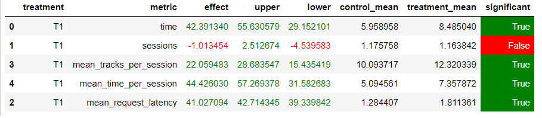

# Инструкция по запуску

Я использовал conda venv. 

Для создания venv необходимо выполнить следующие команды:
```commandline
conda create -n <NAME-VENV> python=3.8
conda activate <NAME-VENV>
```
После создания виртуальной среды и ее активации необходимо установить зависимости ноутбука `hw_jupyter/Week4Seminar.ipynb`.

```commandline
pip install -r hw_requirements.txt
```

Необходимо установить нужную версию torch. У меня CUDA 11.6 поэтому я устанавливал:
```commandline
pip install torch==1.13.1+cu116 torchvision==0.14.1+cu116 torchaudio==0.13.1 --extra-index-url https://download.pytorch.org/whl/cu116
```

## Данные
Перед запуском необходимо скачать данные и поместить в папку `botify/data`

Ссылка для скачивания:
https://drive.google.com/file/d/1uL0KqAMwRqYJ9edy5RdRiSb9vNfj_JuV/view?usp=sharing 


## Генерация рекомендаций
Для получения файла с рекомендациями необходимо прогнать ноутбук `hw_jupyter/Week4Seminar.ipynb`. Файл с рекомендациями 
будет сгенерирован и сохранен в `botify/data/homework_recommendations.json`

## Запуск приложения и A/B тестирование
*Далее запуск проихводится как и на лекциях*

Порядок запуска:
- Необходимо запусть сервис botify, инструкция находится в файле `botify/README.md`

- Запустить A/B тест (Я запускал с такими параметрами `--episodes 2000 --config config/env.yml single --recommender remote --seed 31337`)

- Выгрузить логи, инструкция находится в файле `botify/README.md`.

- Визуализировать результаты A/B теста. Для удобства можно воспользоваться блокнотом `jupyter/Week1Seminar.ipynb`. 
Он ожидает что логи лежат по пути `../tmp/log/data.json` 

# Результат A/B теста

